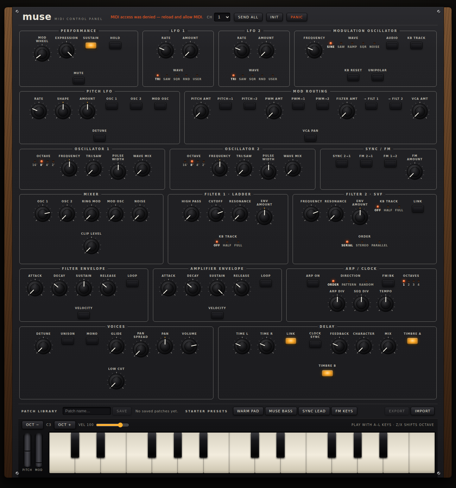

# Moog Muse Interface

A browser-based control panel and patch librarian for the
[Moog Muse](https://www.moogmusic.com/downloads/?product=Muse) 8-voice analog
polysynth — inspired by
[prophet-panel](https://github.com/TonyGermaneri/prophet-panel).



Every front-panel section of the Muse is mirrored on screen — oscillators,
modulation oscillator and routing, dual filters, both envelopes, the three
LFOs, mixer, voice controls, delay, and arp/clock — with **100+ parameters**
wired to the Muse's published MIDI CC chart. Turn a knob on screen and the
Muse responds; turn a knob on the Muse and the screen follows.

## Features

- **Full CC panel** — knobs, illuminated switches, and multi-position
  selectors for every parameter in the Muse MIDI implementation chart
- **Bidirectional sync** — incoming CCs (from the Muse or a controller) update
  the on-screen controls in real time
- **Patch librarian** — save/load patches locally, JSON import/export,
  one-click "Send all" to push the whole panel to the synth, init patch,
  four curated starter presets (Warm Pad, Muse Bass, Sync Lead, FM Keys), and
  a hardware-style A/B compare that swaps between two edit buffers
- **Playable keyboard** — on-screen touch keyboard plus computer-keyboard
  playing (`A`–`L` keys, `Z`/`X` to shift octaves), velocity slider, and a
  Panic button (all sound off / all notes off)
- **Runs anywhere** — plain web app (Web MIDI), installable PWA that works
  offline (service-worker app-shell cache) with a touch-friendly layout for
  tablets, and native **AU / VST3 / Standalone** builds via a thin JUCE
  WebView wrapper (see [`native/`](native/README.md)); the Native plugins
  GitHub Actions workflow uploads ready-built macOS/Windows/Linux plugin
  artifacts

## Quick start (web)

```sh
npm install
npm run dev        # http://localhost:5173
```

Open it in a Web MIDI-capable browser (Chrome, Edge, Opera), allow MIDI
access, and pick your Muse in the **In**/**Out** selectors — ports with
"Muse" in the name are auto-selected. Set **Ch** to match the Muse's MIDI
channel (Settings → MIDI on the synth), and make sure CC transmit/receive is
enabled there.

`npm run build` produces a static `dist/` you can host anywhere; the Pages
workflow deploys it on every push to the default branch or `develop` (the
deploy job needs Pages enabled for the repo with **GitHub Actions** as the
source, otherwise it fails with a 404).

## Native plugin / standalone

The AU (macOS), VST3, and Standalone versions embed the same TypeScript UI in
a JUCE WebView; the only C++ is a ~200-line MIDI bridge. From the repo root:

```sh
npm run build:native
```

See [`native/README.md`](native/README.md) for details, including how to
target **iPad** (standalone app or AUv3 via the JUCE iOS build — the reliable
route on iPad, since iPadOS Safari lacks Web MIDI).

## Project layout

Modules are small, single-purpose files grouped in directories, each exposed
through an `index.ts` barrel, with tests colocated next to the code they cover
(`*.test.ts[x]`, run with `npm test`):

```
src/domain/            Muse parameter model (single source of truth)
  types.ts             Param/Section/EnumOption types
  options.ts           Shared enum ranges (waveforms, octaves, kb-track…)
  builders.ts          knob/toggle/enum factory helpers
  format.ts            Value ↔ label/display mapping
  sections/            One file per panel section (lfos, filters, mixer…)
src/midi/              Transport layer
  webMidiTransport.ts  Web MIDI (browser)
  juceTransport.ts     JUCE WebView bridge (plugins)
  createTransport.ts   Environment detection
  fakeTransport.ts     In-memory transport for tests
src/state/             App state
  museStore.ts         Store class (transport injected, fully testable)
  patchStorage.ts      localStorage persistence + JSON import parsing
  instance.ts          App-wide singleton
  useStore.ts          React binding
src/analog/            Circuit model of the oscillator pair
  constants.ts         Component values (capacitor, threshold, switch, tempco)
  vco.ts               Exponential converter, integrator, comparator, reset
  sync.ts              Hard-sync coupling and trace rendering
  spectrum.ts          Radix-2 FFT and dB magnitude, for the scope display
  patch.ts             Panel CCs to 1V/oct control voltages
src/components/        UI, one directory per component
  knob/  switches/  panel/  toolbar/  keyboard/  patch-library/  scope/
native/                JUCE CMake project (AU / VST3 / Standalone / iOS)
```

Run the suite with `npm test` (Vitest + Testing Library; 83 tests covering the
parameter tables, MIDI transports, store behavior, persistence, controls, and
the oscillator circuit model).

## 1:1 photo mode

For true photorealism the panel can render an actual photograph of the
instrument underneath the controls. Drop a photo at `public/panel-photo.png`
and it becomes the plate: the drawn framing and silkscreen fade out, and the
interactive controls composite on top. Append `?calibrate` to the URL to see
both layers half-transparent with red frame outlines while aligning
`src/components/panel/geometry.ts` to the photograph.

Photo spec for best results: shot straight-on (camera perpendicular to the
faceplate, no keyboard angle), evenly lit without glare, cropped to exactly
the panel area between the wood cheeks, at 3000px wide or more.

## Sync scope

Below the panel sits an outboard scope that shows what **Sync 2→1** (CC 54) is
actually doing. Both panes are driven by a circuit model in
[`src/analog/`](src/analog/) rather than a drawing of the expected shape: an
exponential converter turns each oscillator's control voltage into a charging
current, that current ramps a timing capacitor, a comparator trips at
threshold, and a transistor discharges the capacitor through its own
on-resistance. The master's reset pulse is coupled into the slave's discharge
switch — the same path the comparator uses, which is why hard sync sounds like
the oscillator's own reset rather than an effect laid over it.

Resets are resolved to their true sub-sample times rather than snapped to the
sample grid, so the slave is truncated where it really would be. Move OSC 1's
Frequency knob with sync engaged and the spectrum stays a comb on OSC 2's
fundamental while the formant peak sweeps with OSC 1 — the behavior that makes
a sync lead sound like one.

Two honest limits. The component values are ordinary analog-VCO parts, not
measurements of a Muse: Moog has not published a schematic, so the topology is
right but the part values are representative. And this drives a picture, not
the speakers — every reset is a step discontinuity, so an audio path would need
band-limited correction (BLEP or antiderivative antialiasing) on top of the
model, not merely more oversampling.

The model does reproduce one real artifact for free: because each cycle spends
a finite time discharging and restarts from the residue the switch could not
drain, a control-voltage octave is not exactly an output octave. That error
grows with frequency, which is why a real oscillator needs a high-frequency
trim on top of its 1V/oct scale.

## MIDI mapping notes

CC assignments follow the Muse MIDI implementation chart from Moog's firmware
documentation, as mirrored by the open [midi.guide](https://midi.guide/d/moog/muse/)
dataset ([pencilresearch/midi](https://github.com/pencilresearch/midi)). The
published chart labels CC 81/88 "Delay" within the envelope sections; they are
exposed here as the Decay stages. If a firmware update changes any assignment,
edit `src/domain/params.ts` — it is the single source of truth for the panel.

This is an unofficial community tool, not affiliated with or endorsed by
Moog Music Inc.
